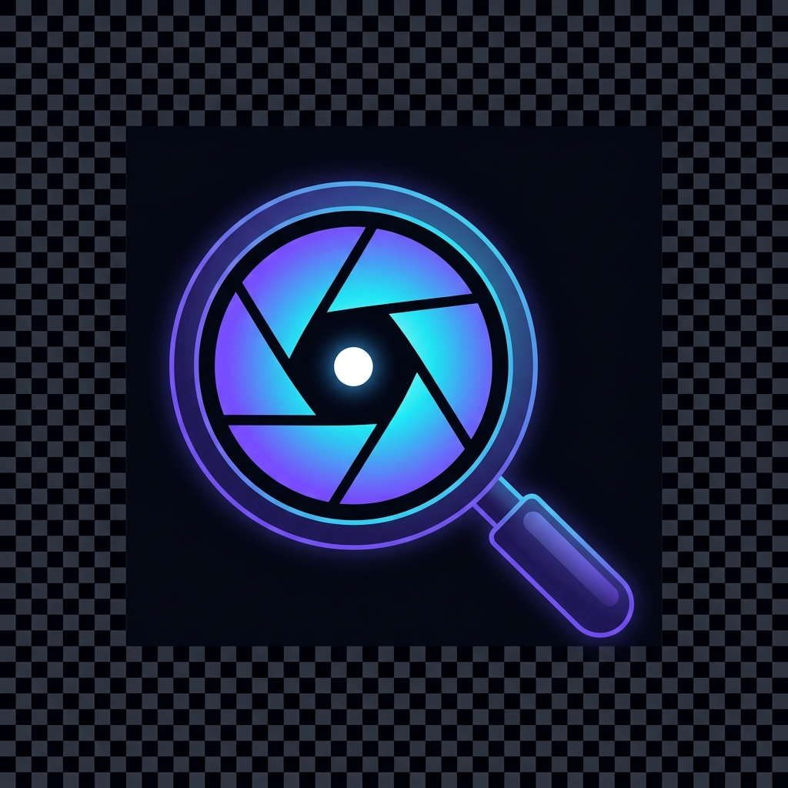

# LensYou — AI Video Intelligence & Study Platform

[](https://opensource.org/licenses/MIT)
[](https://python.org)
[](https://flask.palletsprojects.com/)
[](https://render.com/deploy?repo=https://github.com/ganeshmalli954-arch/lensyou)

**LensYou** is a high-performance AI video intelligence and study dashboard that transforms long-form YouTube lectures, podcasts, and documentaries into timestamped learning outputs.

## 🔗 Live Demo
- **App:** https://lensyou.onrender.com
- If your deployed URL is different, update this link so visitors can test LensYou immediately.

## 🖼️ Product Visuals


- Add your latest UI screenshot(s) and short demo GIF in a future update for stronger first-impression trust.
- Suggested paths: `docs/media/home-dashboard.png`, `docs/media/lensyou-flow.gif`.

## 💎 Why LensYou is Unique
- Handles long-form videos (1–4+ hours) without fallback truncation.
- Produces grounded, timestamped outputs with actionable structure.
- Combines study tools in one flow: flashcards, quizzes, timeline, and mindmaps.
- Includes account-linked history, admin observability, and direct UPI support.

---

## ✨ Key Features

- **Unlimited Lecture Processing:** Analyze multi-hour videos without 10-minute fallback behavior.
- **Grounded AI Copilot:** Ask detailed questions with exact timestamps (`[MM:SS]`).
- **3D Interactive Study Flashcards:** Flip with keyboard controls and self-grade instantly.
- **Concept Mindmaps & Interactive Timeline:** Explore concept clusters and jump to key moments.
- **Production SEO:** JSON-LD schema, OpenGraph, Twitter cards, `robots.txt`, and `sitemap.xml`.
- **Google OAuth + History:** Real account-linked analysis history across devices.
- **Private Admin Portal + 2FA:** Master password + RFC 6238 TOTP security for admin access.
- **Direct UPI Support:** Dynamic QR + one-click mobile UPI launch for payment flow.
- **PDF Intelligence Dossiers:** One-click professional PDF reports with executive summaries.

---

## ⚡ Getting Started in 2 Minutes

### 1) Clone and install dependencies
```bash
git clone https://github.com/ganeshmalli954-arch/lensyou.git
cd lensyou
pip install -r requirements.txt
```

### 2) Create environment file
Create `/home/runner/work/lensyou/lensyou/.env` with:
```env
GEMINI_API_KEY=your_gemini_api_key_here
ADMIN_PASSWORD=your_secure_master_password
FLASK_SECRET_KEY=your_random_secret_key_hex
OWNER_EMAIL=ganeshmalli954@gmail.com
```

### 3) Run LensYou
```bash
python app.py
```
Open http://localhost:5000

---

## 🎯 Use Cases
- **Students:** Convert lectures into revision-ready flashcards and quizzes.
- **Researchers:** Extract structured evidence and timeline-backed notes from long videos.
- **Professionals:** Turn webinars/podcasts into executive summaries and action plans.
- **Creators/Educators:** Build reusable study assets for audience learning workflows.

---

## ☁️ Deployment on Render
This repository includes a production-ready `render.yaml` blueprint with persistent disk storage.

1. Push your repository to GitHub.
2. In the Render Dashboard, click **New + → Blueprint**.
3. Connect this repository.
4. Set environment variables (`GEMINI_API_KEY`, `ADMIN_PASSWORD`, Google OAuth keys, etc.).
5. Apply the blueprint and deploy.

---

## 🤝 Community & Contribution
- Read `/home/runner/work/lensyou/lensyou/CONTRIBUTING.md` before opening changes.
- Use issue templates for bug reports and feature requests.
- Check `/home/runner/work/lensyou/lensyou/ROADMAP.md` for `good first issue` and `help wanted` ideas.

---

## 🛡️ License
Distributed under the MIT License.
